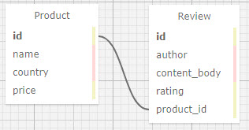
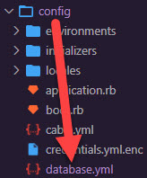

# Mario's Speciality Food Products
#### **Author: Zack Rutledge**
* * *

## Description

This is a project using a one to many relationship to build a food website.

## Technologies used

* HTML
* Bootstrap
* git
* Ruby on Rails
* Embedded Ruby (ERB)
* RSpec
* Bundler
* PostgreSQL

* * *
## User Stories

Users should be able to add, update and delete new products. Don't worry about user authentication. Assume everyone who visits the site is an admin for now.
Users should be able to click an individual product to see its detail page. (You will not be expected to show the product's average rating. That's included in the further exploration section.)
Users should be able to add a review to a product.

* * *
## Schema



* * *
## Software Requirements
* **Ruby is required to run this application**
* **PostgreSQL is required to run the database**

 <a href="https://www.learnhowtoprogram.com/ruby-and-rails/getting-started-with-ruby/installing-ruby">Ruby download instructions</a>
  <a href="https://www.learnhowtoprogram.com/ruby-and-rails/getting-started-with-ruby/installing-postgres">PosgreSQL download instructions</a>

## Installation Instructions
1. Navigate to the desired directory where you would like to clone the project to.

2. Once you have chosen your desired directory, clone the github repo using the version control tool `git` (<a href="https://www.learnhowtoprogram.com/introduction-to-programming/getting-started-with-intro-to-programming/git-and-github">download instructions</a>). Typing the following command into your terminal:
```bash
$ git clone https://github.com/Dethik/Marios_Speciality_Food_Products
```
3. Open the project in VSCode by typing the following in your terminal:

``` bash
$ code .
```
* Note: VSCode is a code editing software. If you don't already have it, you can download it <a href="https://code.visualstudio.com/">here</a>

4. While located in the root directy, install gem bundler by typing:

``` bash
$ gem install bundler
```

5. Install gem bundles by typing:

``` bash
$ bundle install
```

6. Add your PSQL Username and Password to the database.yml file located within the config folder!
<br>


7. Create a database for this project by typing the following into your terminal while located in the root directory:
```
$ rake db:create
```

8. Add all tables to the database by typing the following in your terminal:
```
$ rake db:migrate
```

9. Mirror the migration database changes in the test database:
```
$ rake db:test:prepare
```

The database should now be correctly set up. And you may start a local server to interact with the project.

9. To start a local server, open your default browser and type "localhost:3000" into the search bar and press enter. Here, you will see the live server.

## Running Tests
* This application was created using test-driven development (TDD).
* To run the tests yourself, follow the steps below.

Simply type "rspec" into your terminal while located in the root directory of the project.
``` bash
$ rspec
```
* * *

## License
> [GPLv3](https://choosealicense.com/licenses/gpl-3.0/)\
> Zack Rutledge &copy; 2021

* * *

## Contact Information

Reach Zack via <a href="https://www.linkedin.com/in/zack-rutledge762/" target="_blank">Linkedin</a> or <a href="thorgrim88@gmail.com" target="_blank">email</a></li>.